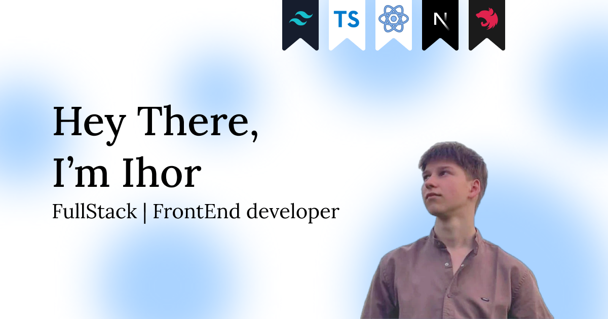
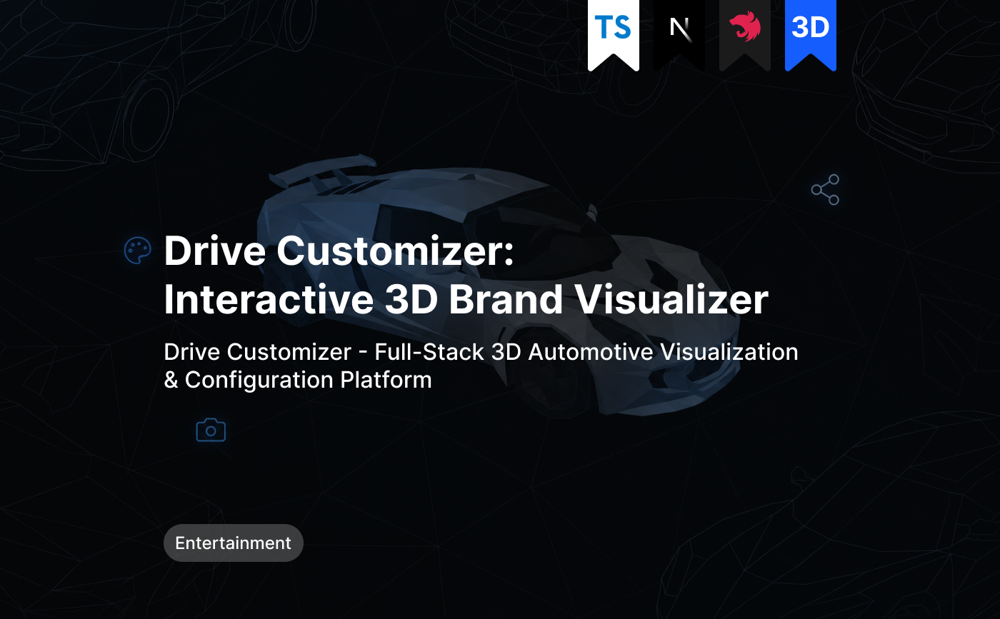
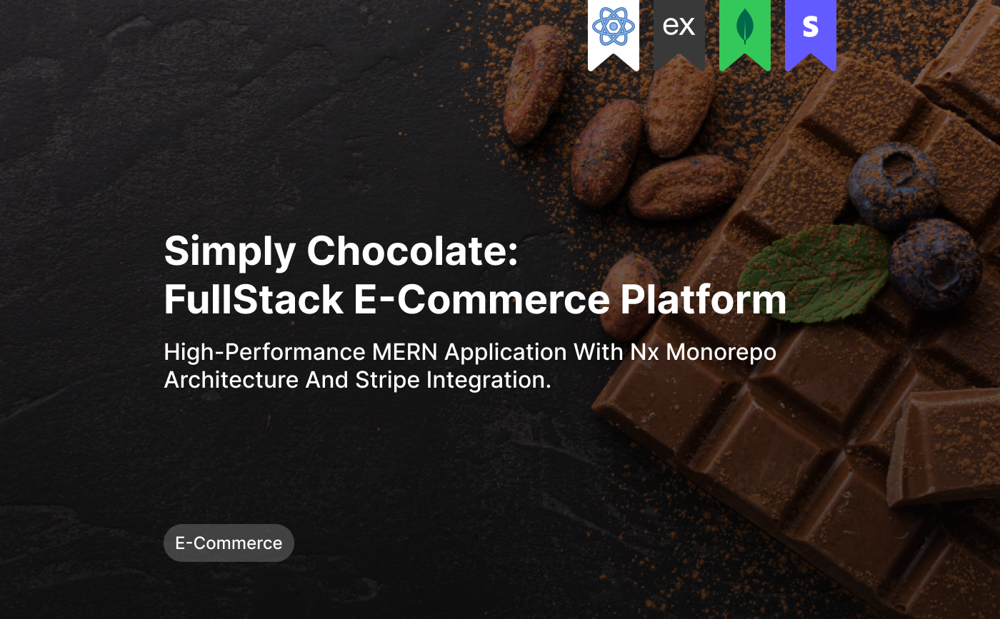
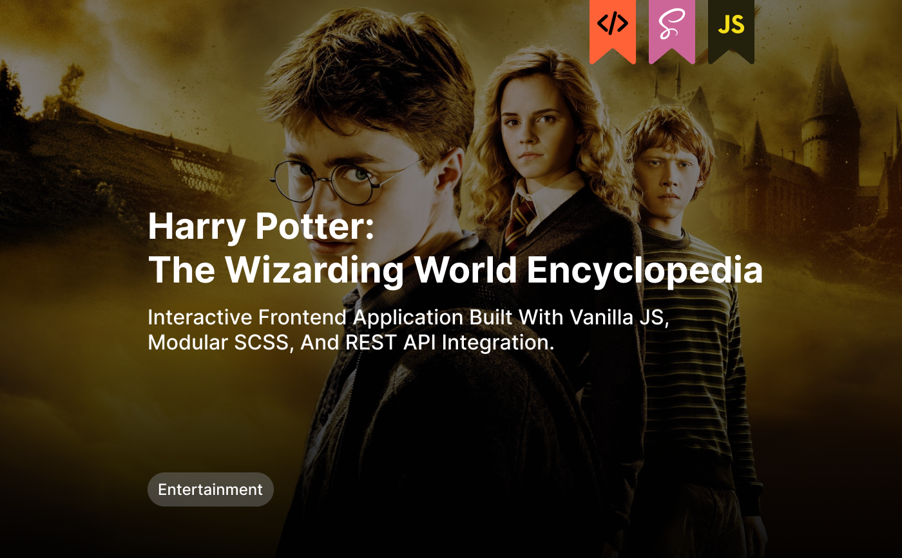

# Ihor Vnuk — Portfolio

Personal portfolio website of a Full Stack developer. Dark modern UI, project case studies, skills, experience, and contact section.

**Live:** [ihor-vnuk-portfolio.vercel.app](https://ihor-vnuk-portfolio.vercel.app/)

[](https://ihor-vnuk-portfolio.vercel.app/)
[](https://nextjs.org/)
[](https://www.typescriptlang.org/)
[](https://tailwindcss.com/)

---

## Preview

<p align="center">
  
</p>

### Featured projects

|                         Drive Customizer                         |                          Simply Chocolate                          |                     Harry Potter Encyclopedia                      |
| :--------------------------------------------------------------: | :----------------------------------------------------------------: | :----------------------------------------------------------------: |
|  |    |        |
| [Live](https://drive-customizer.vercel.app/) · Drive customizer  | [Live](https://my-simply-chocolate.vercel.app/) · Simply chocolate | [Live](https://d-r-a-k-e-n.github.io/Harry-Potter/) · Harry Potter |

---

## Features

- Hero section with decorative animations (orbit, stars, float)
- Blue gradient blobs in the background
- Portfolio with dedicated case study pages
- About: Skills (icons), Experience, Education + Download CV
- Smooth scroll to sections with sticky header offset
- Responsive layout (mobile → desktop)
- SEO: Open Graph, metadata, canonical URL

---

## Tech stack

| Layer         | Tools                                                                                                       |
| ------------- | ----------------------------------------------------------------------------------------------------------- |
| Framework     | [Next.js 16](https://nextjs.org/) (App Router)                                                              |
| Language      | [TypeScript](https://www.typescriptlang.org/)                                                               |
| UI            | [React 19](https://react.dev/), [Tailwind CSS 4](https://tailwindcss.com/), [Base UI](https://base-ui.com/) |
| Icons         | [react-icons](https://react-icons.github.io/react-icons/)                                                   |
| Styling utils | [class-variance-authority](https://cva.style/), [tailwind-merge](https://github.com/dcastil/tailwind-merge) |
| Tooling       | ESLint, Prettier                                                                                            |
| Deploy        | [Vercel](https://vercel.com/)                                                                               |

---

## Getting started

### Requirements

- Node.js **20+**
- npm (or yarn / pnpm / bun)

### Install

```bash
git clone https://github.com/d-r-a-k-e-n/portfolio.git
cd portfolio
npm install
```

### Dev server

```bash
npm run dev
```

Open [http://localhost:3000](http://localhost:3000).

### Production build

```bash
npm run build
npm start
```

---

## Scripts

| Command                | Description                    |
| ---------------------- | ------------------------------ |
| `npm run dev`          | Start local development server |
| `npm run build`        | Create production build        |
| `npm start`            | Run production build           |
| `npm run lint`         | Run ESLint                     |
| `npm run format`       | Format with Prettier           |
| `npm run format:check` | Check Prettier formatting      |

---

## Project structure

```text
src/
├── app/                    # App Router (layout, page, project routes)
│   ├── portfolio-project/[id]/
│   ├── globals.css
│   └── layout.tsx
├── components/
│   ├── sections/           # Hero, Portfolio, About, Contact…
│   ├── portfolio/          # Project case UI
│   ├── ui/                 # Button, Separator
│   └── …
├── constants/              # Projects, skills, links, routes
├── types/
└── lib/
public/                     # Images, CV, OG image
```

---

## Contact

- **Portfolio:** [ihor-vnuk-portfolio.vercel.app](https://ihor-vnuk-portfolio.vercel.app/)
- **GitHub:** [d-r-a-k-e-n](https://github.com/d-r-a-k-e-n)
- **LinkedIn:** [ihor-vnuk](https://www.linkedin.com/in/ihor-vnuk)
- **Telegram:** [@ihor_vnuk](https://t.me/ihor_vnuk)
- **Email:** [ihor.vnuk.it@gmail.com](mailto:ihor.vnuk.it@gmail.com)
- **Upwork:** [profile](https://www.upwork.com/freelancers/~017aeecf317781f664)

---

## License

Private project. © Ihor Vnuk. All Rights Reserved.
